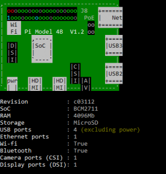

# Raspberry Pi 4 Voice Assistant

-purple.svg)

Local voice assistant for Raspberry Pi 4 (8 GB).  
It records from a mic, transcribes with Faster-Whisper, generates a short reply using a local LLM (Llama 2 C Stories 110M GGUF on llama.cpp), then speaks the answer with eSpeak.

---

## Contents
- [Features](#features)
- [Hardware](#hardware)
- [Quick start](#quick-start)
- [How it works](#how-it-works)
- [Models](#models)
- [Repository layout](#repository-layout)
- [Performance notes](#performance-notes)

---

## Features
- Button controlled sessions on GPIO 17
- Chunked recording at 16 kHz
- Faster-Whisper STT with a single shared int8 model
- Local LLM via llama.cpp
- eSpeak for fast speech output
- Auto stop on silence with configurable threshold and timeout

---

## Hardware
- **Board** Raspberry Pi 4 Model B 8 GB
- **Mic and speakers** any ALSA visible devices
- **Button wiring** connect a momentary push button between **GPIO 17** and **GND (pin 6)**

---

## Quick start

    sudo apt update
    sudo apt install -y python3-venv python3-pip portaudio19-dev espeak alsa-utils

    python3 -m venv .venv
    source .venv/bin/activate

    pip install --upgrade pip
    pip install sounddevice numpy psutil RPi.GPIO faster-whisper

    python -m pipeline.main       --duration 15       --enable-stt-partials       --threads 4       --n-predict 12       --temperature 0.6

Tips  
- Set sensible mic input levels to avoid false silence triggers  
- Pair Bluetooth speakers and set them as default if you use them

---

## How it works

    Mic -> Recorder (0.5 s chunks @ 16 kHz)
        -> Faster-Whisper STT (shared int8 model)
        -> LLM (llama.cpp via wrapper)
        -> eSpeak TTS
        -> Speakers

- The button loop monitors GPIO 17. Press to start a session.  
- The recorder streams fixed size PCM chunks.  
- Faster-Whisper keeps one model loaded in memory to avoid cold starts.  
- The llama.cpp wrapper streams short replies from a tiny GGUF.  
- eSpeak speaks each sentence as soon as it arrives.

---

## Models

### Speech to text
- **Engine** Faster-Whisper
- **Default model** `tiny.en`
- **Compute type** int8 on CPU

### Language model
- **Model** Llama 2 C Stories 110M pruned50 Q3_K_M (GGUF)
- **Backend** llama.cpp (`llama-cli`)
- **Default path** `~/models/llama2.c-stories110M-pruned50.Q3_K_M.gguf`

Run with explicit paths if needed:

    python -m pipeline.main       --llama-cli ~/llama.cpp/build/bin/llama-cli       --llama-model ~/models/llama2.c-stories110M-pruned50.Q3_K_M.gguf

---

## Repository layout

    pipeline/
      main.py           -> CLI entrypoint and GPIO 17 loop
      config.py         -> sample rate, chunk duration, silence settings
      recorder.py       -> background audio capture
      stt_faster.py     -> Faster-Whisper STT with shared model and partials
      stt.py            -> whisper.cpp CLI fallback (kept for reference)
      llm_model.py      -> llama.cpp wrapper and eSpeak helper
      orchestrator.py   -> connects recorder, STT, LLM and eSpeak, plus stats
    tests/
      ...               -> quick hardware and latency checks
    assets/
      Pinout1-275x300.png

---

## Performance notes
Ballpark on Raspberry Pi 4 8 GB:

| Component        | Latency (s) | Notes                           |
|------------------|-------------|---------------------------------|
| Whisper CLI      | ~10         | Too slow on CPU                 |
| Faster-Whisper   | ~5          | Shared int8 model kept warm     |
| eSpeak           | <0.2        | Near instant                    |
| End to end       | ~5          | Short prompt round trip         |

---

